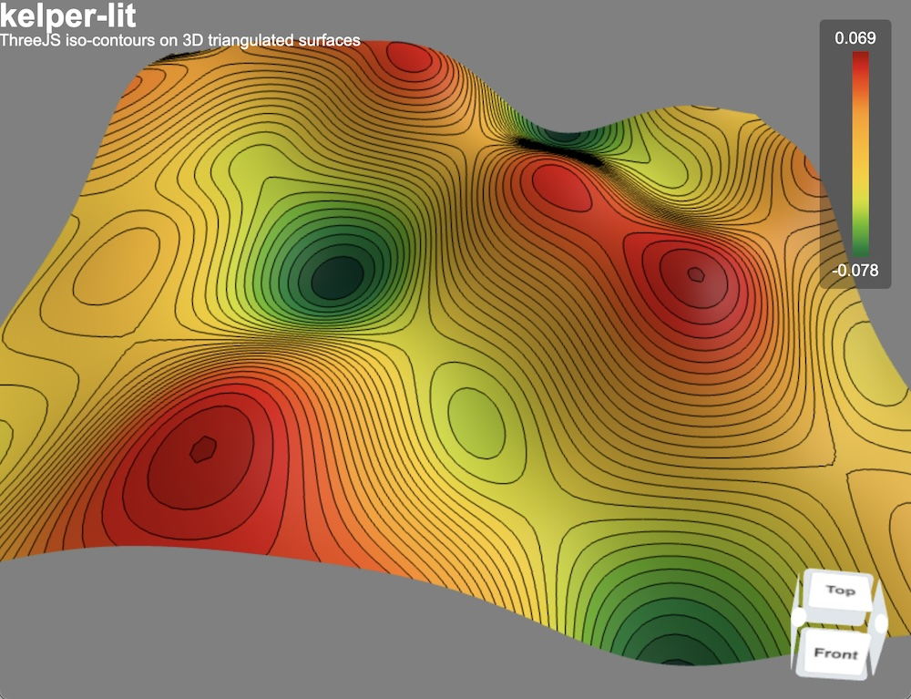

# Three.js with iso-contours on 3D triangulated surfaces

<p align="center">
    
</p>

# Usage
```ts
import { Surface, generateIsoValues } from "kelper-lit"

const vertices: number[] = ... ;
const indices : number[] = ... ;

const zCoord  = vertices.filter((_, index) => index % 3 === 2);

const surface = new Surface(vertices, indices, scene)

surface.generateIsos({
    attribute  : zCoord,
    isoList    : generateIsoValues(zCoord, 20), // 20 iso-contours
    lut        : 'Blackbody',
    viewFilled : true,
    viewLines  : true
})
```

## Install
```bash
git clone https://github.com/xaliphostes/kelper-lit.git
npm install
```

## Serve
```bash
npm run serve
```

## Visualize
Then open [this link](http://localhost:8000/web)

## See
- https://github.com/Fennec-hub/three-viewport-gizmo
- https://fennec-hub.github.io/three-viewport-gizmo/examples/yomotsu-camera-controls.html?type=sphere
- 
- https://github.com/yomotsu/camera-controls